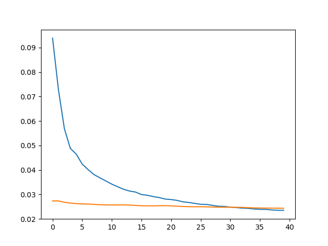

# Musical-Instrument-Separator-UNet
A deep learning project using the U-Net model to accurately separate individual musical instruments from audio recordings.
## About the project
 Most of the present solutions that exist for the source separation problem are based on taking the Fourier Transform of the audio, studying the characteristic frequency spectrum 
 of a particular source type , then masking that particular band out. In computer vision U-Nets have been used for a while 
 for Image Segmentation problems , but not much work has been done on U-Nets being used for audio datasets . Since in a way thinking about source separation problem , I segmented
 the different frequency bands of the audio sample ,
 hence I felt that U-Nets could be potentially useful for source separation problem too. So I decided to give my own novel and naive innovation an attempt .

 ## Result
 Here is the result I [achieved](https://github.com/prachitui/Musical_Instrument_Separation/blob/main/Results_MIS.wav).

 ## Description of the Model
* The input layer takes in audio data with variable-length sequences (shape: (None, 64)).

* The model starts with a series of convolutional layers (Conv1D) with increasing filters (16, 32, 64, 128, 256, 512), each followed by batch normalization and leaky ReLU activation.

* Then, the model performs upsampling (transposed convolution) using Conv1DTranspose layers to restore the spatial resolution.

* At each upsampling stage, skip connections are implemented by concatenating the upsampled features with the corresponding features from the encoding path using Concatenate layers.

* ReLU activation is applied after each concatenation.

* Dropout layers with a dropout rate of 0.5 are used after the first and third upsampling stages.

* Finally, a Conv1DTranspose layer with 1 filter is used to generate a mask, and the output layer applies element-wise multiplication (Multiply) between the input audio and the mask.

 ## Training the Model
* The loss function is specified as Mean Absolute Error ('mae'), which measures the average absolute difference between the predicted and target values.

* The optimizer chosen is Adam, with a learning rate of 1e-3.

* The training data (x_train and y_train) and validation data (x_val and y_val) are prepared by converting them into TensorFlow tensors. The df_train and df_test DataFrames are used to extract the respective input (x) and target (y) data.

* The epochs parameter is set to 40, indicating the number of times the model will iterate over the entire training dataset.

* The verbose parameter is set to 2 to display a detailed progress bar, providing information about the training and validation steps.

## Plotting the Graph of Train_Error and Val_Error with each Epoch

The model is tested on the 11th track of mus_test. The predicted track have been uploaded as [Resuluts_MIS.wav](https://github.com/prachitui/Musical_Instrument_Separation/blob/main/Results_MIS.wav).
The 11th track was too big to be uploaded.
